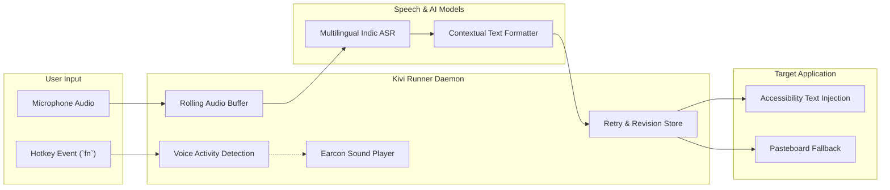

# Kivi 🎙️⚡

> **Ambient, multilingual AI voice dictation and execution companion for personal computing.**

[](#)
[](#)
[](#)
[](#)

---

## 📖 Overview

**Kivi** is an AI-first ambient voice layer designed to replace typing with high-velocity spoken thought. Engineered from the ground up to support natural **multilingual code-switching** across 22+ Indian languages and English, Kivi operates seamlessly across your entire operating system.

Whether drafting emails, writing technical documentation in VS Code, messaging colleagues on Slack, or executing terminal scripts, Kivi captures your intent and injects clean, properly formatted, context-aware text instantly.

---

## 📚 Product Documentation Index

This repository maintains the strategic, technical, and architectural foundation for the Kivi ecosystem:

| Document | Purpose |
| :--- | :--- |
| **[Product Vision](product%20vision.md)** | Long-term vision, core philosophy, user problems, and multi-horizon evolution roadmap. |
| **[Product Positioning](product%20position.md)** | Target audience, personas, market differentiation matrix, competitive analysis, and GTM strategy. |
| **[Engineering Plan](plan.md)** | Phase-by-phase implementation plan, Gantt roadmap, milestone deliverables, and technical stack. |
| **[Runner Architecture](runner.md)** | Detailed specification of the background audio runner, hotkey listener daemon, state machine, and earcon audio cues. |

---

## ⚡ Core Features

* **Global Ambient Invocation (`fn` Key):** Always ready in the background. Press and hold to talk, or double-tap for continuous dictation.
* **Fluid Code-Switching:** Effortlessly mix vernacular languages (Hindi, Tamil, Telugu, Kannada, Marathi, Bengali, etc.) and English mid-sentence without changing modes.
* **Context-Aware Formatting:** Intelligently punctuate, capitalize, format numerals/currencies, and strip disfluencies based on the active application.
* **Audio Feedback (Earcons):** Subconscious, non-intrusive sound cues (`start.wav`, `complete.wav`, `soften.wav`, `error.wav`) confirm runner states without taking your eyes off the screen.
* **Fault-Tolerant Runner:** Offline queuing and background retry engine (`RecordRetryAllRunner`) guarantee no spoken thought is lost during network interruptions.
* **Privacy & Local Control:** Local encryption, configurable data retention, and instant incognito mode.

---

## 🏗️ Architecture At A Glance



---

## 🚀 Getting Started

### Prerequisites
* macOS 14.0 (Sonoma) or newer (Apple Silicon recommended).
* Microphone access permission.
* Accessibility & Input Monitoring permissions (for global hotkey detection and text insertion).

### Running Kivi CLI & Tools
To interact with Kivi or inspect development builds:
```bash
# Clone the repository
git clone https://github.com/Ugine27/Kivi.git
cd Kivi

# Launch development environment with Antigravity
agy
```

---

## 🛡️ License

Copyright © 2026. All rights reserved.