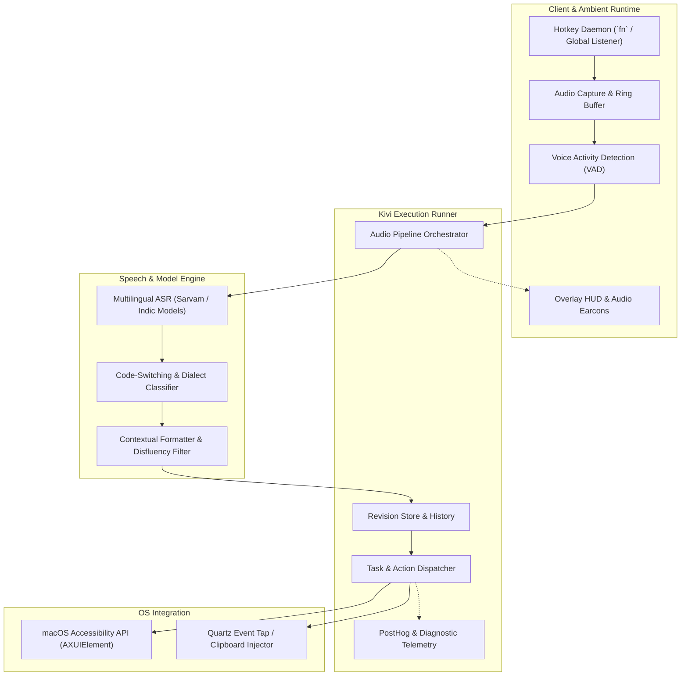
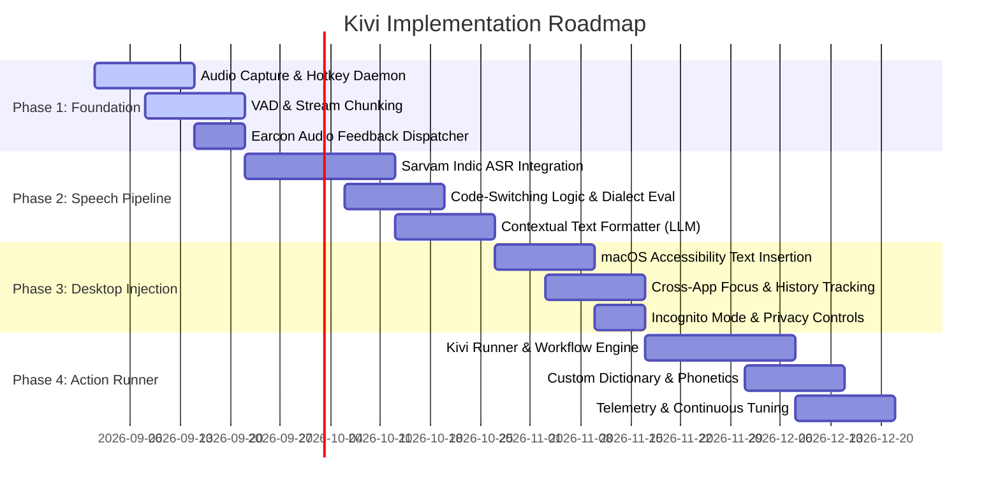

# Engineering & Product Plan — Kivi 🗓️

---

## 1. Technical Architecture Overview

Kivi is composed of four modular layers designed for high responsiveness, low memory footprint, and modular integration:

---

## 2. Release Milestones & Roadmap

---

## 3. Phase Breakdown & Deliverables

### Phase 1: Core Foundation & Ambient Runtime
- **Audio Capture Subsystem:** 16kHz mono audio capture via CoreAudio / AVAudioEngine with ring-buffer streaming.
- **Voice Activity Detection (VAD):** Low-latency Silero-VAD or WebRTC VAD to detect speech start, pause, and endpointing.
- **System Event Listener:** Low-overhead global event tap for `fn` key press-to-talk and toggle modes.
- **Earcon Feedback:** Seamless audio feedback triggered at state transitions (`start.wav`, `complete.wav`, `error.wav`).

### Phase 2: Speech & Intelligence Pipeline
- **ASR Engine Integration:** Bidirectional streaming connection to high-accuracy multilingual ASR models.
- **Code-Switching Engine:** Real-time decoding capable of transcribing Hindi/Tamil/Telugu interleaved with English syntax.
- **Post-Processing & Formatting:** Context-aware grammar repair, intelligent punctuation, numeral and currency conversion, and removal of filler words.

### Phase 3: Desktop Integration & Injection
- **Universal Text Insertion:** Integration with macOS Accessibility API (`AXUIElementSetAttributeValue`) with fallback to pasteboard simulation for non-AX applications.
- **Context Extraction:** Querying focused window title, active application bundle ID, and nearby surrounding text buffer to adjust tone and structure.
- **Local History & Revisions:** SQLite/CoreData revision log allowing instantaneous `Cmd+Z` undo or quick revision tap.

### Phase 4: Kivi Action Runner
- **Command & Action Dispatcher:** Triggering system actions (open applications, search web, run CLI commands) when intent flags are detected.
- **Custom Dictionary & Personal Lexicon:** User-defined vocabulary list for technical jargon, internal product names, and abbreviations.
- **Telemetry & Diagnostics:** Privacy-first telemetry (PostHog) tracking transcription latency, error rates, and failure recovery.

---

## 4. Technical Stack

| Component | Technology | Rationale |
| :--- | :--- | :--- |
| **Desktop App Runtime** | Swift / AppKit / SwiftUI | Native macOS performance, minimal battery overhead, direct Metal & CoreAudio access. |
| **Audio Processing** | CoreAudio / AVAudioEngine | Low-latency audio I/O with hardware acceleration. |
| **Speech Models** | Sarvam AI ASR / Whisper / Custom Indic | Industry-leading performance on 22+ Indian languages and code-switched audio. |
| **System Event Tap** | Quartz Event Services (`CGEventTap`) | Reliable system-wide key interception (`fn` key). |
| **Text Injection** | macOS Accessibility (`AXUIElement`) | Non-destructive in-place text modification. |
| **Diagrams & Visuals** | Mermaid.js + WebKit / Metal Renderer | Lightweight inline diagram and UI rendering. |

---

## 5. Risk Assessment & Mitigations

| Risk | Impact | Likelihood | Mitigation Strategy |
| :--- | :---: | :---: | :--- |
| **macOS Accessibility Permissions Friction** | High | High | Clear, onboarding wizard guiding users to grant Accessibility and Input Monitoring permissions. |
| **Network Latency Spikes in Cloud ASR** | High | Medium | Implement local on-device quantized model fallback for offline/low-bandwidth environments. |
| **Text Insertion Incompatibilities (Electron apps)** | Medium | Medium | Hybrid injection: try Accessibility API first; fallback to simulated clipboard paste if unhandled. |
| **False Endpointing during Pauses** | Medium | Low | Dynamic VAD hysteresis based on user speech cadence and sentence context. |
