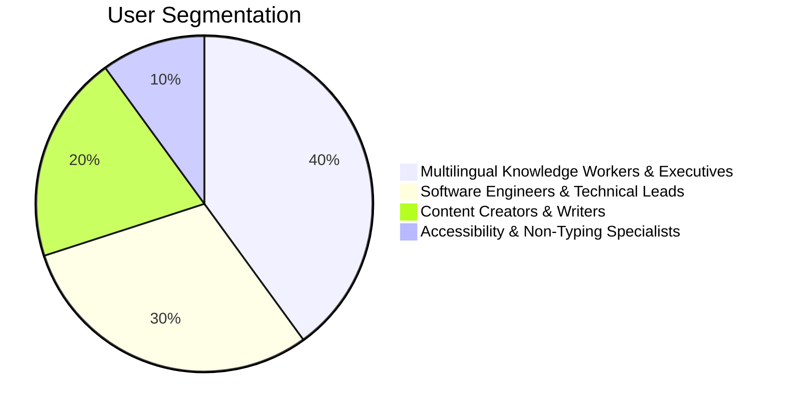

# Product Positioning — Kivi 🎯

---

## 1. Positioning Statement

> **For** multilingual knowledge workers, developers, and creators  
> **Who** lose hours daily typing and struggle with speech tools that cannot handle mixed-language natural conversations,  
> **Kivi** is an ambient, AI-powered desktop voice companion  
> **That** delivers sub-second voice dictation and execution with native multilingual code-switching across 22+ languages,  
> **Unlike** traditional OS dictation or legacy transcription services that require monotonic, single-language speech and rigid commands,  
> **Kivi** seamlessly integrates into any desktop workflow, understanding technical vocabulary, regional accents, and hybrid language patterns out of the box.

---

## 2. Target Personas



### Persona 1: The Bilingual / Multilingual Professional ("Vikram")
* **Role:** Product Manager / Consultant / Operations Lead.
* **Workflow:** High volume of Slack messages, Jira tickets, Notion specs, and emails.
* **Pain Point:** Frequently thinks and communicates using colloquial expressions or mixed phrasing (Hinglish, Tanglish, etc.). Existing tools produce phonetic errors or get confused when an English technical word appears in an Indian-language sentence.
* **Kivi Value:** Zero-friction ambient voice typing that captures natural phrasing without forcing unnatural linguistic separation.

### Persona 2: The Developer / Technical Builder ("Ananya")
* **Role:** Full-Stack Engineer / Data Scientist.
* **Workflow:** VS Code, Terminal, GitHub PR reviews, documentation.
* **Pain Point:** Traditional voice tools cannot handle code-style identifiers, camelCase, snake_case, terminal flags, or indentation structures.
* **Kivi Value:** Context-aware code formatting, voice command triggers via runner scripts, and instant hotkey accessibility (`fn`).

### Persona 3: The Content Creator & Strategist ("Rohan")
* **Role:** Marketing Strategist / Copywriter / Researcher.
* **Workflow:** Long-form essays, brainstorms, meeting syntheses, social posts.
* **Pain Point:** Brainstorming is slowed down by typing speed. Transcription tools require recording whole audio files and uploading them to third-party web apps.
* **Kivi Value:** Live stream-of-consciousness capture directly into their active writing app with intelligent punctuation, paragraphing, and tone correction.

---

## 3. Competitive Landscape & Differentiation Matrix

| Capability / Feature | Kivi | Apple / OS Dictation | Superwhisper / Wispr Flow | Otter.ai / Descript |
| :--- | :---: | :---: | :---: | :---: |
| **Real-time Code-Switching** | ✅ **Native (22+ Languages)** | ❌ Single Language | ⚠️ Limited / Unstable | ❌ Post-upload only |
| **Ambient Desktop Injection** | ✅ **System-wide (`fn`)** | ✅ Built-in | ✅ Native Overlay | ❌ App/Web sandbox |
| **Contextual Awareness** | ✅ Active App & Buffer | ❌ None | ⚠️ Basic | ❌ None |
| **Indian Dialects & Vernaculars** | ✅ **Optimized (Sarvam AI)** | ❌ English-biased | ❌ Western-centric | ❌ Western-centric |
| **Earcon / Audio Feedback** | ✅ Sound Cues & State | ⚠️ Generic Beep | ⚠️ Visual Only | ❌ N/A |
| **Runner & Workflow Automations** | ✅ Integrated Runner | ❌ None | ❌ None | ⚠️ Meeting summaries |
| **Privacy & Local Processing** | ✅ Private / Incognito Mode | ⚠️ Partial on-device | ⚠️ Partial on-device | ❌ Cloud-hosted |

---

## 4. Key Value Propositions (The 4 Pillars)

```
+-------------------------------------------------------------------+
|                           KIVI PILLARS                            |
+---------------------------------+---------------------------------+
| 1. Radical Code-Switching       | 2. Ambient Desktop Native       |
| Fluid mid-sentence switching    | Immediate invocation anywhere;  |
| across Indian languages & EN.   | zero latency, minimal UI footprint |
+---------------------------------+---------------------------------+
| 3. Intelligent Formatting       | 4. Autonomous Action Runner     |
| Punctuation, capitalization,    | Beyond dictation: execution     |
| disfluency removal, formatting. | of scripts, workflows, & tasks. |
+---------------------------------+---------------------------------+
```

---

## 5. Go-To-Market (GTM) Strategy

1. **OEM & Hardware Bundling:**
   * Pre-installed deployment on OEM partners (e.g., HP laptops in India) providing Day-1 utility for millions of users unfamiliar with English-only mechanical keyboards.
2. **Developer & Prosumer Adoption:**
   * Mac power-user distribution targeting developer teams, tech writers, and startups via direct binary download, Homebrew, and community plugins.
3. **Enterprise & Accessibility Expansion:**
   * B2B deployments for customer support desks, legal drafting, healthcare dictation, and inclusive computing initiatives.
