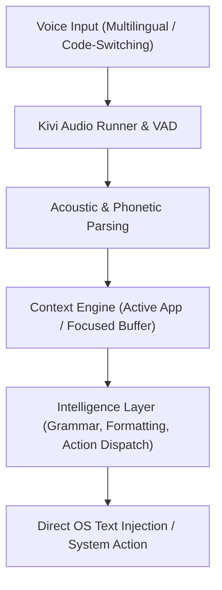

# Product Vision — Kivi 🎙️

> **"Transforming speech into thought-speed action through voice-first, multilingual ambient computing."**

---

## 1. Executive Summary

Computing has been constrained by the keyboard and mouse for over four decades. While language is humanity's most intuitive, dense, and expressive tool for communication, human voice input has historically suffered from rigid command sets, high error rates, and failure to grasp cultural and linguistic nuance—especially in multilingual regions.

**Kivi** is built to dismantle these limitations. It is an AI-first, ambient desktop voice engine engineered to make speaking as fast, natural, and ubiquitous as thinking. Designed ground-up for multilingual users and fluid code-switching (mixing vernacular languages like Hindi, Tamil, Telugu, Kannada, Marathi with English), Kivi integrates directly into the operating system to power dictation, dynamic content editing, and automated action execution.

---

## 2. The Core Problem

1. **The Typing Bottleneck:** 
   Average typing speed is ~40 words per minute, whereas spoken thought moves comfortably at 130–160 words per minute. Knowledge workers lose hours every day translating cognitive intent into keyboard strokes.
2. **The Multilingual Divide:** 
   Existing speech engines (Apple Dictation, Google Voice Typing, Windows Speech) are single-language centric. Millions of professionals operate in a hybrid linguistic mode (e.g., Hinglish or Tanglish) where terms, syntax, and jargon blend seamlessly. Conventional engines either produce gibberish or force artificial linguistic boundaries.
3. **Passive Dictation vs. Active Interaction:** 
   Traditional tools only type what you say verbatim. They fail to format punctuation, remove disfluencies ("um", "ah"), understand technical contexts (camelCase, Markdown, code blocks), or trigger actions.

---

## 3. Product Vision & Principles

### Vision Statement
> To become the universal ambient voice layer for personal computing—where any user, speaking naturally in any dialect or code-switched register, can control, compose, and execute on their computer without touching a keyboard.

### Core Design Principles

* **Zero-Latency Ambient Presence:** Always available with a single keystroke (e.g., tap or hold `fn`). No browser tabs, no window switching, no waiting.
* **Radical Multilingual Fluency:** Native support for 22+ languages and continuous mid-sentence code-switching without needing manual language toggling.
* **Contextual Intelligence:** Understands where the user is typing—adapting formatting for email, Slack, VS Code, terminal shells, or spreadsheets.
* **Privacy & Local-First Philosophy:** Audio and transcript data prioritize on-device inference, transparent data retention controls, and incognito operation.
* **Subtle, Non-Intrusive Feedback:** Audio cues (earcons) and micro-animations confirm listening, processing, and insertion states without disrupting flow.

---

## 4. Key Capabilities & Horizons

### Horizon 1: Universal Natural Dictation (Current)
* Ultra-fast speech-to-text with auto-punctuation, number formatting, and smart capitalisation.
* Real-time code-switching between Indic languages and English.
* Desktop integration with macOS Accessibility and global event monitors.

### Horizon 2: Smart Voice Transformation
* Voice-driven editing: "Rewrite this more professionally", "Bullet point the last paragraph", "Convert this table to JSON".
* Personal dictionary with phonetic adaptation for custom names, acronyms, and technical libraries.

### Horizon 3: The Autonomous Action Runner
* Voice-to-Action: Direct triggering of local terminal scripts, workspace tools, system settings, and multi-step desktop workflows.
* Cross-application synthesis: Pulling data across apps and generating cohesive outputs through voice commands.

---

## 5. Success Metrics

| Dimension | Metric | Long-term Target |
| :--- | :--- | :--- |
| **Speed** | End-to-End Latency (Speech End to Text Commit) | `< 350 ms` |
| **Accuracy** | Multilingual & Code-Switched Word Error Rate (WER) | `< 4.5%` |
| **Adoption** | Daily Active Words Dictated per User | `> 2,500 words` |
| **Reliability** | Successful Injections without Manual Correction | `> 92%` |
| **System Footprint** | Background CPU & Memory Idle Overhead | `< 1% CPU, < 120MB RAM` |
