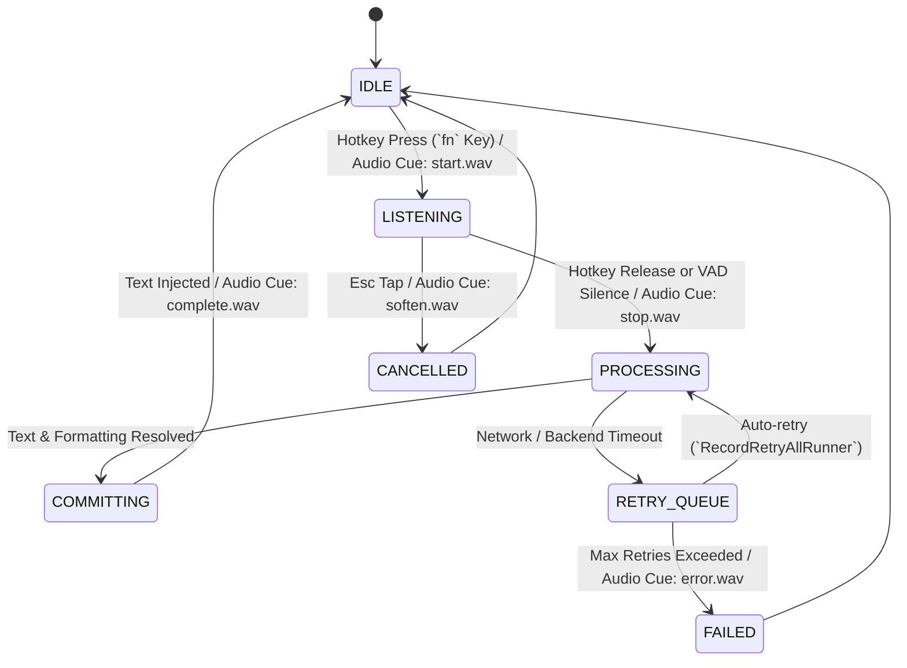

# Kivi Runner Architecture & Specification ⚡

---

## 1. Overview

The **Kivi Runner** is the core execution daemon operating in the background of the user's operating system. It orchestrates real-time audio capture, hotkey detection, voice activity detection (VAD), model communication, earcon sound cues, text injection, and retry handling.

---

## 2. Core Responsibilities

1. **Ambient Hotkey Management:** Captures the global activation trigger (default: `fn` key hold or double-tap) across all active applications without consuming keyboard events.
2. **Audio Stream Lifecycle:** Maintains a rolling low-latency ring buffer, applies noise suppression, and detects speech boundaries.
3. **Engine Routing & Orchestration:** Routes streaming audio frames to the ASR pipeline, receiving partial and finalized hypotheses.
4. **Earcon Sound Dispatcher:** Plays synchronous, low-latency auditory feedback cues indicating runner state.
5. **Universal Text Injection:** Identifies the active target application and injects finalized text into the focused text field.
6. **Fault Tolerance & Retry Queue (`RecordRetryAllRunner`):** Buffers failed audio transmissions during network blips and retries background synchronization without data loss.

---

## 3. State Machine

---

## 4. Runner Subsystems

### 4.1. Hotkey & Event Interceptor (`DictationGate`)
* **Mechanism:** Quartz Event Tap (`CGEventTapCreate`) listening at `kCGHIDEventTap` level.
* **Modes:**
  * **Push-to-Talk (Hold):** Audio records while `fn` is depressed; stops and commits upon release.
  * **Toggle Mode (Double-Tap):** First double-tap activates continuous listening; second tap stops and commits.
* **Emergency Bail-out:** Tapping `Esc` immediately cancels active listening, discards current audio buffer, and emits `soften.wav`.

### 4.2. Audio Capture & Buffer Manager
* **Sample Format:** Linear PCM 16-bit, 16,000 Hz, Single Channel (Mono).
* **Frame Size:** 20ms chunks (320 samples per frame).
* **Ring Buffer:** 30-second rolling buffer allowing retrospective capture of speech onset preceding hotkey press by up to 250ms.

### 4.3. Earcon Audio Dispatcher
Earcons provide non-visual confirmation so the user does not need to look away from their work:

| Sound Cue | File | Trigger Event |
| :--- | :--- | :--- |
| **Start** | `start.wav` | Runner transitions to `LISTENING` |
| **Stop** | `stop.wav` | Audio capture ends; model begins inference |
| **Complete** | `complete.wav` | Text successfully injected into target field |
| **Error** | `error.wav` | Transcription failure or service unreachable |
| **Blocked** | `blocked.wav` | Inaccessible target window or missing permissions |
| **Cancel** | `soften.wav` | User aborted session with `Esc` |
| **Notify** | `notify.wav` | Background sync or dictionary update alert |

### 4.4. Injection Engine & Target Resolution
* **Focus Resolution:** Obtains target application via `NSWorkspace.shared.frontmostApplication`.
* **Primary Injection Path (AXUIElement):**
  1. Acquire system-wide accessibility element: `AXUIElementCreateSystemWide()`.
  2. Query `kAXFocusedUIElementAttribute`.
  3. Extract selected text range or caret position.
  4. Write text via `kAXValueAttribute` or `kAXSelectedTextAttribute`.
* **Secondary Injection Path (Pasteboard Fallback):**
  * If the target window does not expose standard AX text attributes (e.g. certain gaming UI or custom WebViews):
    1. Temporarily backup existing `NSPasteboard` contents.
    2. Place generated text on clipboard.
    3. Synthesize `Cmd+V` keypress event.
    4. Restore original pasteboard state after 150ms delay.

---

## 5. Resilience & Retry Logic (`RecordRetryAllRunner`)

In the event of network disruption or backend service degradation:
* Audio recordings are serialized to local encrypted SQLite storage (`RevisionStore`).
* The runner sets an exp-backoff timer to retry unresolved dictations.
* User is alerted non-intrusively via `notify.wav` once offline items are transcribed and ready to review.
* Searchable history of recent dictations remains available locally for quick retrieval and re-insertion.
